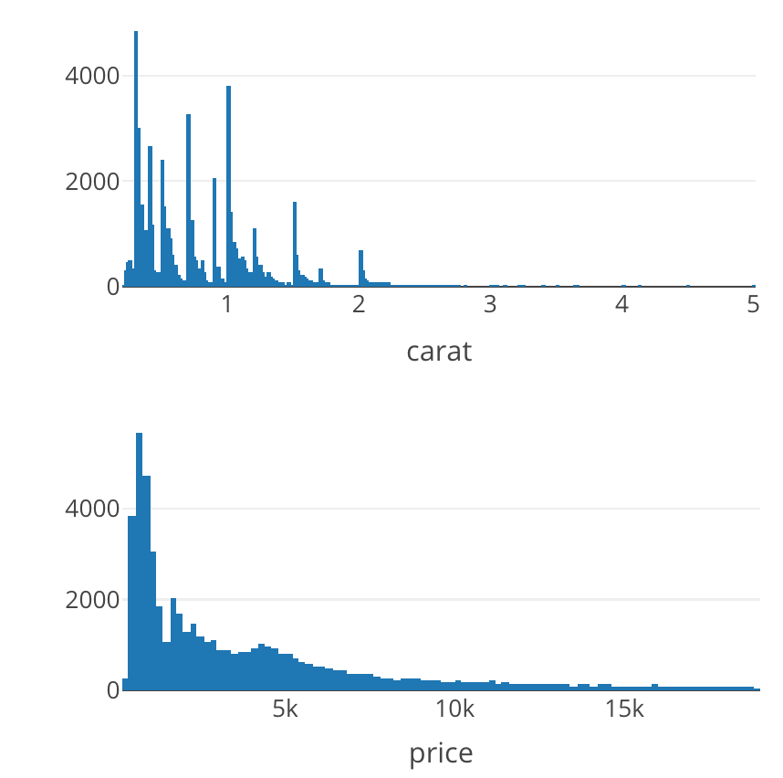

<!-- badges: start -->
[](https://github.com/rstudio/htmltools)
[](https://CRAN.R-project.org/package=htmltools)
[](https://www.rpackages.io/package/htmltools)
[](https://www.rpackages.io/package/htmltools)
[](https://lifecycle.r-lib.org/articles/stages.html)
<!-- badges: end -->

# htmltools <a href='https://rstudio.github.io/htmltools/'></a>

Tools for creating, manipulating, and writing HTML from R.

## Installation

Install the stable release of `htmltools` on CRAN:

```r
install.packages("htmltools")
```

Install the development version with:

```r
remotes::install_github("rstudio/htmltools")
```

## Quick overview

`{htmltools}` makes it easy to customize the user interface (UI) of any [Shiny](https://shiny.rstudio.com/) or [R Markdown](https://rmarkdown.rstudio.com/) project by using R code to generate custom HTML (including JavaScript and CSS).

[This Shiny article](https://shiny.rstudio.com/articles/html-tags.html) provides a great introduction to `{htmltools}` (even if you're not interested in Shiny). As you'll learn in that article, the general foundation that `{htmltools}` provides allows other R packages (e.g., [`{htmlwidgets}`](http://www.htmlwidgets.org/), [`{crosstalk}`](https://rstudio.github.io/crosstalk/), etc.) to provide "HTML components" in R that users can manipulate and combine in ways the component authors didn't foresee.

For example, as described in depth [here](https://plotly-r.com/arranging-views.html#arranging-htmlwidgets), `{htmltools}` makes it fairly easy to arrange numerous `{htmlwidgets}` (e.g., `{plotly}` graphs) into a single static HTML webpage:

```r
library(htmltools)
browsable(tagList(
  plot_ly(diamonds, x = ~carat, height = 200),
  plot_ly(diamonds, x = ~price, height = 200)
))
```

<div align="center">
  
</div>

Also, thanks to `tagQuery()`, it is fairly easy to query and manipulate the underlying HTML structure of components. See the [`tagQuery()` article](https://rstudio.github.io/htmltools//articles/tagQuery.html) to learn more.


## Learn more

If you're looking to learn how to build more custom user interfaces by  writing custom HTML/JavaScript/CSS, we recommend the following resource:

* Shiny's [UI](https://shiny.rstudio.com/articles/#user-interface) and [extensions](https://shiny.rstudio.com/articles/#extensions) articles
* [Outstanding UI with Shiny](https://unleash-shiny.rinterface.com/) by David Granjon
* [JavaScript for R](https://book.javascript-for-r.com/) by John Coene
